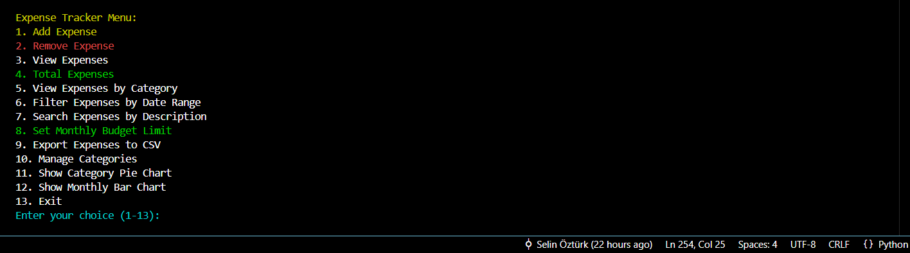
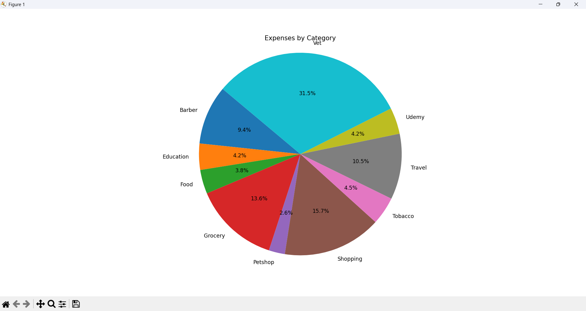
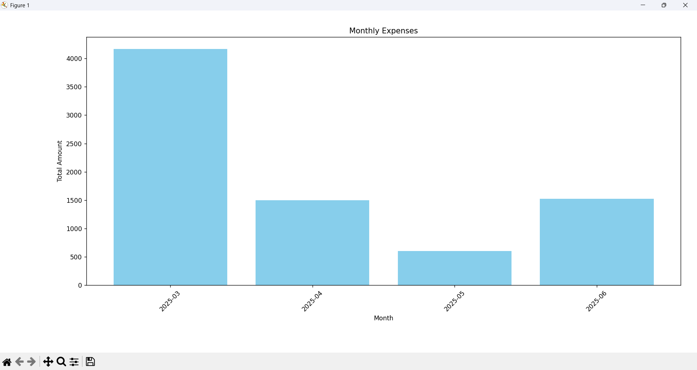

# 💸 CLI Expense Tracker

A terminal-based Expense Tracker application built with Python and SQLite. It allows you to track your spending, set budget limits, analyze expenses, and export data — all through a colorful, interactive menu system.

---

## 📌 Features

- 💾 **SQLite database integration** for persistent storage
- 🧾 **Add, remove, and view expenses**  
- 📅 **Filter expenses by date range**  
- 🔍 **Search expenses by description**  
- 🗂️ **Categorize expenses and manage categories**  
- 🧮 **View total expenses and category breakdown**  
- 📈 **Graphical analysis**  
  - Category-wise pie chart  
  - Monthly bar chart  
- 📤 **Export expenses to CSV**  
- 🎯 **Set monthly budget limits**  
- 🎨 **Colorful and user-friendly terminal interface (via `colorama`)**

---

## 🖥️ Menu Preview



*(The image above shows the actual menu as seen in the terminal.)*

---

## 🧱 Technologies Used

- **Python 3**
- **SQLite** (`sqlite3`)
- **CSV** module for export
- **Matplotlib** for visualizations
- **Colorama** for colorful CLI
- **Datetime**, **os**, and other built-in libraries

---

## 📊 Sample Graphs

### Category Distribution



### Monthly Expenses



---

## 📂 File Structure

```
ExpenseTracker/
├── expense_tracker/
|   ├── main.py                     # Main CLI app
|   ├── plot_utils.py               # Analysis & chart functions
|
├── screenshots/
│   ├── category_chart.png
│   ├── monthly_expenses.png
|   └── terminal.png
|
├── expenses.db                     # SQLite database
├── expenses_export.csv             # Saves data to CSV
├── requirements.txt
└── README.md
```

---

## 🚀 Getting Started

1. Clone the repository:
   ```bash
   git clone https://github.com/Selinoztrk/cli-expense-tracker.git
   cd ExpenseTracker
   cd expense_tracker
   ```

2. Install dependencies:
   ```bash
   pip install matplotlib colorama
   ```

3. Run the application:
   ```bash
   python expense_tracker.py
   ```

---

## 📝 Notes

- The SQLite database saves all data automatically.
- Budget limit warnings are displayed if exceeded.
- Graphs open in interactive windows and update based on current data.

---

## ✅ To-Do (Planned Enhancements)

- [ ] Add recurring expenses
- [ ] Currency selection (€, $, ₺, etc.)
- [ ] Multi-user support with login
- [ ] Web-based or GUI version (Tkinter/PyQt/Flask)

---

Feel free to ⭐ the repo or contribute via issues and pull requests.  
**Happy tracking! 💰**